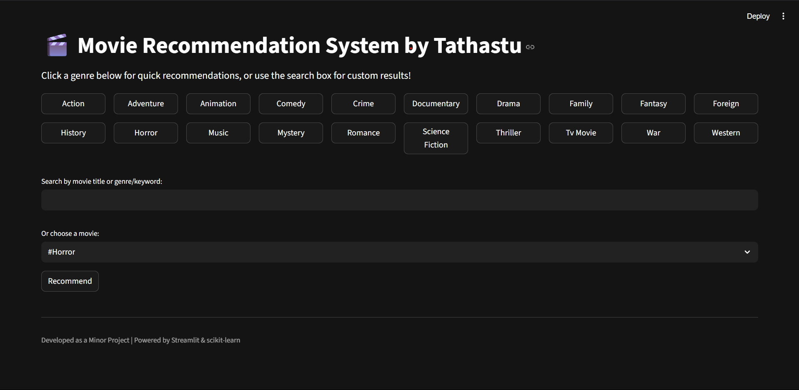
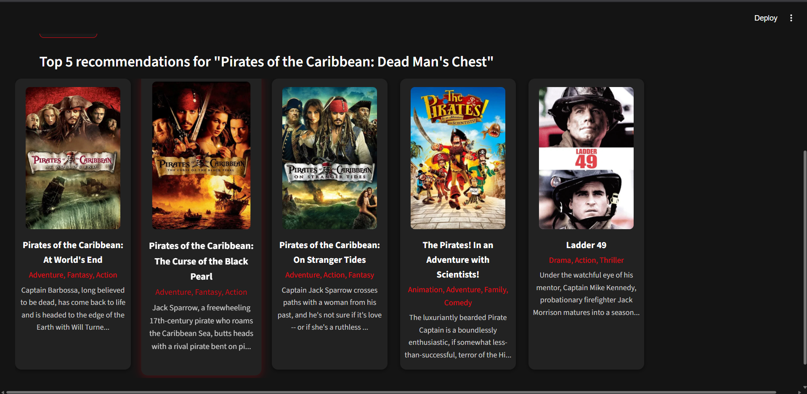
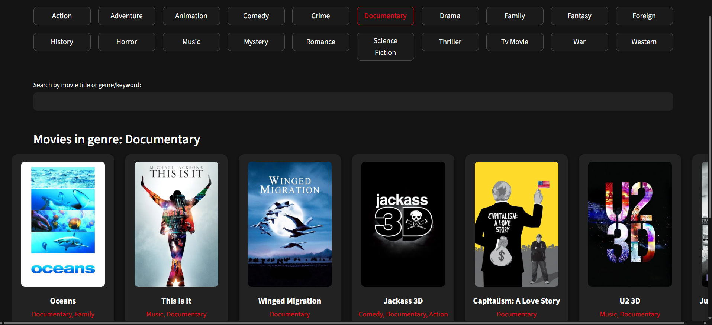

# 🎬 Movie Recommendation System

A Netflix-inspired, interactive movie recommendation web app built with **Streamlit** and **scikit-learn**. Instantly get personalized movie suggestions based on your favorite titles or genres, powered by content-based filtering on the TMDb 5000 Movie Dataset.

---

## Features

- **Netflix-like UI:** Modern, responsive design with genre buttons and horizontal movie carousels.
- **Content-Based Recommendations:** Suggests similar movies using NLP and cosine similarity on movie metadata.
- **Genre Browsing:** Instantly explore movies by genre with a single click.
- **Search Functionality:** Find recommendations by movie title, genre, or keyword.
- **Movie Details:** See posters, genres, and overviews for each recommended movie.
- **Powered by TMDb:** Fetches up-to-date posters and movie info using the TMDb API.

---

## Demo



<!-- (Add your own screenshot if available) -->

---

## How It Works

1. **Data Preparation:**  
   - Loads and merges `tmdb_5000_movies.csv` and `tmdb_5000_credits.csv`.
   - Extracts and processes genres, keywords, cast, crew, and overview for each movie.
   - Creates a "tags" field for each movie by combining all relevant text features.
   - Applies stemming and vectorization (Bag-of-Words) for efficient similarity search.

2. **Recommendation Engine:**  
   - Computes cosine similarity between movies based on their tags.
   - Given a movie title, returns the top 5 most similar movies.

3. **Web App (Streamlit):**  
   - Users can search by title, genre, or keyword.
   - Genre buttons allow quick browsing.
   - Movie posters and details are fetched live from TMDb.

---

## Installation

1. **Clone the repository:**
   ```bash
   git clone https://github.com/yourusername/movie-recommender.git
   cd movie-recommender
   ```

2. **Install dependencies:**
   ```bash
   pip install -r requirements.txt
   ```
   *(Create a `requirements.txt` with: `streamlit pandas scikit-learn nltk requests`)*

3. **Download the datasets:**  
   Place `tmdb_5000_movies.csv` and `tmdb_5000_credits.csv` in the project root.  
   *(You can find these on [Kaggle TMDb 5000 Movie Dataset](https://www.kaggle.com/datasets/tmdb/tmdb-movie-metadata))*.

4. **Run the app:**
   ```bash
   streamlit run app.py
   ```

---

## Usage

- **Genre Browsing:** Click any genre button at the top to see movies in that genre.
- **Search:** Use the search box to find recommendations by movie title or genre.
- **Direct Recommendation:** Select a movie from the dropdown and click "Recommend" for similar movies.

---

## File Structure

```
.
├── app.py                  # Streamlit web app
├── movie_recommender.py    # Recommendation engine and data processing
├── tmdb_5000_movies.csv    # Movie metadata (from Kaggle)
├── tmdb_5000_credits.csv   # Cast and crew data (from Kaggle)
```

---

## API Keys

This app uses the TMDb API for fetching posters.  
A demo API key is included, but for production or heavy use, [get your own TMDb API key](https://www.themoviedb.org/documentation/api).

---

## Acknowledgements

- [TMDb 5000 Movie Dataset (Kaggle)](https://www.kaggle.com/datasets/tmdb/tmdb-movie-metadata)
- [Streamlit](https://streamlit.io/)
- [scikit-learn](https://scikit-learn.org/)
- [NLTK](https://www.nltk.org/)

---

## License

This project is for educational purposes.

---

**Developed by Tathastu Mishra | Minor Project**

---

